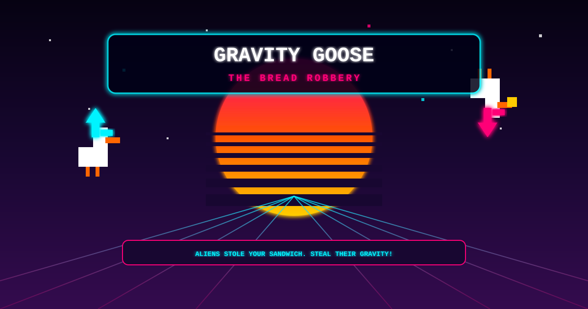

<div align="center">
  

  <h1>Gravity Goose: The Bread Robbery</h1>

  <p>
    
    
    
    
  </p>

  <p>
    <em>Aliens stole your sandwich. Steal their gravity!</em>
  </p>
</div>

## 📖 Table of Contents

- [Features](#-features)
- [Controls](#-controls)
- [How to Play / Setup](#-how-to-play--setup)
- [Contributing](#-contributing)
- [License](#-license)

## ✨ Features

- **Gravity Flip:** Press a button to instantly reverse gravity! Master ceiling-walking to avoid hazards and outsmart enemies.
  <br/>
  <!-- Add GIF of Gravity Flip here -->
- **Blink Dash:** Teleport a short distance to phase through danger and extend your jumps.
  <br/>
  <!-- Add GIF of Blink Dash here -->
- **Epic Boss Fight:** Face off against the Alien Frog Armada in a bullet-hell finale.
- **Speedrun Ready:** All your best times and stats are saved locally using LocalStorage. Compete with yourself for the best runs!
- **Neo-Retro Touch Controls:** On phones/tablets a glassmorphism gamepad with crisp pixel-art icons appears — D-Pad (left) plus Jump/Blink/Flip (right), driven purely by `touchstart`/`touchend` with haptic vibration and zero tap-delay. Landscape floats the translucent buttons over the screen edges; portrait switches to a solid "Gameboy Mode" panel. Tapping the canvas flips gravity, just like a click.

## 🎮 Controls

| Action           | Keyboard                         | Mouse        | Touch (mobile)     |
| :--------------- | :------------------------------- | :----------- | :----------------- |
| **Move**         | `A` / `D` or `←` / `→`           | -            | On-screen D-Pad    |
| **Jump**         | `W` / `↑` (hold for higher jump) | -            | Jump button        |
| **Blink (Dash)** | `SHIFT`                          | -            | Blink button       |
| **Flip Gravity** | `SPACE`                          | `Left Click` | Tap the canvas     |

## 🚀 How to Play / Setup

Running the game locally is incredibly easy. No build tools or servers are required!

1. Clone or download this repository.
   ```bash
   git clone https://github.com/your-username/gravity-goose.git
   ```
2. Navigate to the project folder.
3. Open `index.html` in any modern web browser (Chrome, Firefox, Edge, Safari).
   - _Alternative:_ Double-click `index.html` from your file explorer.
4. Enjoy!

## 🤝 Contributing

Want to create your own levels or add new mechanics? Check out our [Developer & Level Design Guide](CONTRIBUTING.md) to get started!

## 📜 License

This project is licensed under the [MIT License](LICENSE).
